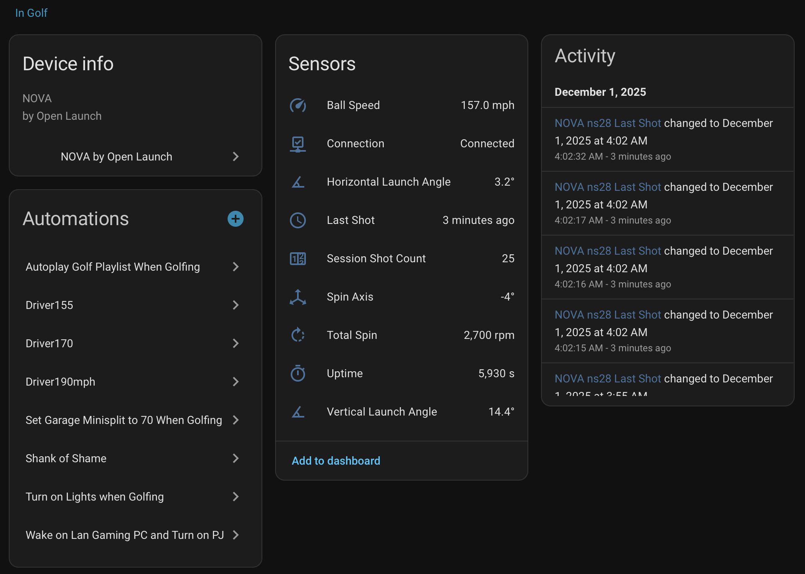

# NOVA by Open Launch - Home Assistant Integration

[](https://my.home-assistant.io/redirect/hacs_repository/?owner=OpenLaunchLabs&repository=homeassistant-nova&category=integration)

A Home Assistant HACS integration for [NOVA](https://openlaunch.io) golf launch monitors by Open Launch. Connects to your device via WebSocket and exposes real-time shot data as sensor entities with automatic mDNS discovery.



## Features

- **Automatic Discovery** - Devices are automatically discovered via mDNS/Zeroconf
- **Real-Time Shot Data** - Ball speed, launch angles, spin rate, and more via WebSocket
- **Status Monitoring** - Device uptime and connection status
- **Auto-Reconnect** - Automatically reconnects if connection is lost
- **HACS Compatible** - Easy installation via Home Assistant Community Store

## Prerequisites

- [HACS](https://hacs.xyz) installed in your Home Assistant instance
- NOVA device powered on and connected to your local network
- Home Assistant and NOVA on the same network/subnet (required for mDNS discovery)

## Quick Start

1. Install via HACS (see below)
2. Power on your NOVA - Home Assistant will discover it automatically
3. Click the discovery notification and confirm the device name

That's it. Sensors will populate as you hit shots.

## Installation

### HACS (Recommended)

1. Open HACS in Home Assistant
2. Click the three dots in the top right corner
3. Select "Custom repositories"
4. Add this repository URL and select "Integration" as the category
5. Click "Add"
6. Find "NOVA by Open Launch" in HACS and click "Download"
7. Restart Home Assistant

### Manual Installation

1. Copy the `custom_components/nova_by_openlaunch` folder to your Home Assistant `config/custom_components/` directory
2. Restart Home Assistant

## Configuration

### Automatic Discovery (Recommended)

1. Ensure your NOVA device is powered on and connected to your network
2. Home Assistant will automatically discover the device via mDNS
3. Go to **Settings > Devices & Services**
4. You should see a discovery notification for your NOVA device
5. Click "Configure" and confirm the device name

### Manual Configuration

If automatic discovery doesn't work (e.g., different subnets), you can add the device manually:

1. Go to **Settings > Devices & Services**
2. Click "Add Integration"
3. Search for "NOVA by Open Launch"
4. Enter your device details:
   - **Name**: A friendly name for your device
   - **Host**: IP address of your launch monitor
   - **Port**: WebSocket port (default: 2920)

## Sensors

### Shot Data (updated on each shot)

| Sensor | Unit | Description |
|--------|------|-------------|
| Ball Speed | m/s | Ball velocity at launch |
| Vertical Launch Angle | ° | Launch angle (up/down) |
| Horizontal Launch Angle | ° | Launch angle (left/right) |
| Total Spin | rpm | Ball spin rate |
| Spin Axis | ° | Spin axis tilt |
| Session Shot Count | - | Running shot count for the session |
| Last Shot | - | Timestamp of most recent shot |

### Status Data (updated periodically)

| Sensor | Unit | Description |
|--------|------|-------------|
| Connection | - | Connected/Disconnected |
| Uptime | s | Device uptime |

## Troubleshooting

### Device not discovered

- Confirm the NOVA and Home Assistant are on the same subnet
- Check that mDNS/multicast traffic is not blocked by your router or VLAN configuration
- Try a manual configuration with the device's IP address (check your router's client list to find it)

### Cannot connect (manual setup)

- Verify the device is powered on and connected to the network
- Confirm you can reach the device IP from your Home Assistant host
- Check that port 2920 is not blocked by a firewall
- Check Home Assistant logs under **Settings > System > Logs** for connection errors

### Sensors show "unavailable"

- The WebSocket connection is not active - the integration retries every 10 seconds automatically
- Verify the device is still reachable on the network
- Restart the integration from **Settings > Devices & Services**

## Protocol

This integration uses WebSocket for data streaming, discovered via mDNS/Zeroconf.

### mDNS Discovery

The device advertises the following mDNS service:
- **Service type**: `_openlaunch-ws._tcp.local.`
- **TXT records**: `manufacturer`, `model`, `version`, `hostname`, `serial`

### WebSocket Messages

**Shot Message** (sent when a shot is taken):
```json
{
  "type": "shot",
  "shot_number": 1,
  "timestamp_ns": 1764477382748215552,
  "ball_speed_meters_per_second": 34.37,
  "vertical_launch_angle_degrees": 7.5,
  "horizontal_launch_angle_degrees": -11.8,
  "total_spin_rpm": 1684.2,
  "spin_axis_degrees": -3.7
}
```

**Status Message** (sent periodically):
```json
{
  "type": "status",
  "uptime_seconds": 3512,
  "firmware_version": "0.1.0",
  "shot_count": 5
}
```

## License

Apache License 2.0 - see [LICENSE](LICENSE) for details.

## Credits

Developed for [Open Launch](https://openlaunch.io) NOVA launch monitors.
